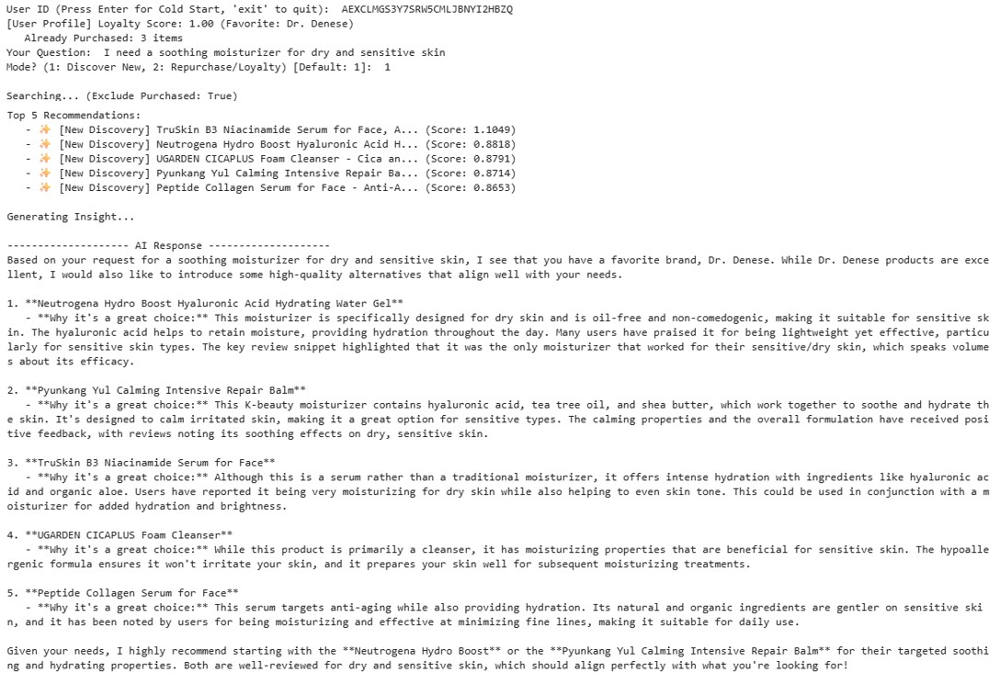
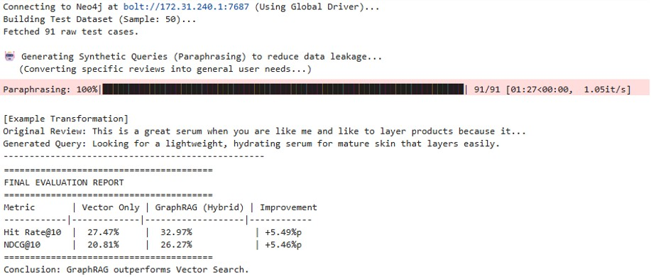
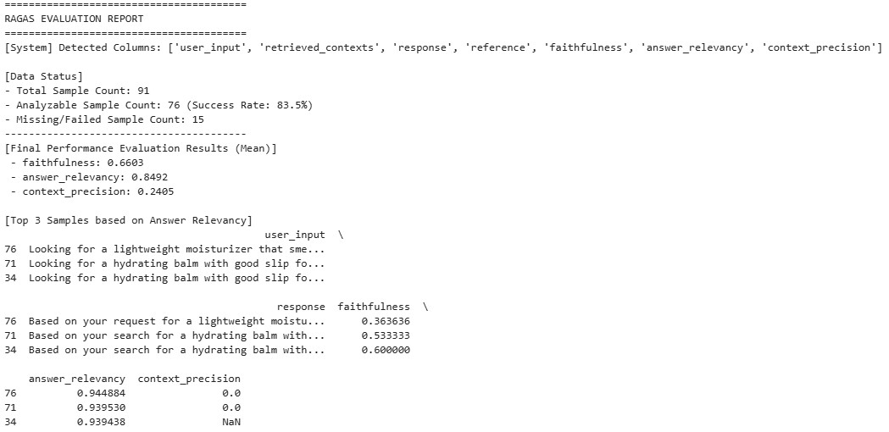
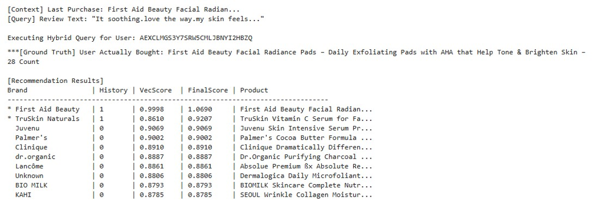

# Hybrid GraphRAG: Personalized Skincare Recommendation Engine

[](https://nbviewer.org/github/sykwon0901/amazon-skincare-graphrag/tree/main/)
[]()

> **Project Goal:** To overcome the limitations of traditional Vector Search by injecting **User Brand Loyalty signals (Knowledge Graph)** into the retrieval process, realizing a dynamic and context-aware recommendation system.

---

## Executive Summary (Key Results)

This project demonstrates that a **Hybrid GraphRAG** architecture significantly outperforms traditional Vector Search baselines, especially for ambiguous user queries.

| Metric | Vector Only (Baseline) | Hybrid GraphRAG (Proposed) | Improvement |
| :--- | :--- | :--- | :--- |
| **Hit Rate@10** | 27.47% | **32.97%** | **+5.49%p** |
| **NDCG@10** | 20.81% | **26.27%** | **+5.46%p** |

* **Impact:** Achieving a **~5.5%p increase** in Hit Rate proves that leveraging 'Purchase History' as a graph signal acts as a critical tie-breaker when semantic similarity alone is insufficient.
* **Quality:** The qualitative evaluation (using GPT-4o as a judge) confirmed high **Answer Relevancy (0.85)**, ensuring the AI explains *why* a product fits the user's specific skin concerns.

---

## Methodology

### 1. The Problem
Traditional ML algorithms (CF) suffer from cold-start problems, while standard Vector Search lacks personalization context.
* **Solution:** A Hybrid approach combining **Semantic Understanding** (Vector) + **Brand Loyalty** (Graph).

### 2. Architecture & Data
* **Data Source:** Subset of [Amazon Reviews 2023](https://amazon-reviews-2023.github.io/) (Category: Facial Skincare, filtered for 'Core Users' with 5+ purchases).
* **Tech Stack:** Neo4j (Graph + Vector Index), OpenAI (GPT-4o-mini, text-embedding-3-small), LangChain, Ragas.

### 3. Core Algorithm
1. **Candidate Generation:** Retrieves top-150 products using Vector Search (Cosine Similarity).
2. **Dynamic Reranking:** Applies a **Log-weighted Boost** based on the user's historical interaction with the brand in the Knowledge Graph.
    * *Formula:* $FinalScore = VectorScore \times (1 + \log(1 + HistoryCount) \times weight)$

---

## Case Study: Dynamic Personalization

The system demonstrates real-time adaptability. For the **same query** ("*soothing moisturizer*"), it provides different rankings based on the user ID:

* **User A (Cold Start):** Recommends generally popular items (e.g., Neutrogena).
* **User B (Loyal to 'TruSkin'):** Recognizes the affinity and boosts **TruSkin B3 Serum** to **Rank #1 (Score > 1.0)**, explicitly mentioning the user's preference in the generated response.
---
### 🚀 Demo & Evaluation Proofs

**1. Live Demo(Personalization)**


**2. Quantitative Results (Hit Rate & NDCG)**


**3. Qualitative Metrics (RAGAS Scores)**


**4. Ranking Process**

---

## Robust Engineering (Safe Mode)
During the qualitative evaluation pipeline, the system encountered OpenAI API rate limits/timeouts.
* **Handling:** Instead of crashing, a **'Safe Mode'** was implemented to catch `TimeoutError`, filter invalid samples, and proceed with the remaining valid dataset (N=76, 83.5% success rate), ensuring statistical validity without losing progress.

---

## How to Run
1. **Clone the repository**
    ```bash
    git clone [https://github.com/YOUR_USERNAME/amazon-skincare-graphrag.git](https://github.com/YOUR_USERNAME/amazon-skincare-graphrag.git)
    ```
2. **Install dependencies**
    ```bash
    pip install -r requirements.txt
    ```
3. **Configuration**
    * Set up a Neo4j instance (AuraDB or Local).
    * Add your `OPENAI_API_KEY` and Neo4j credentials in the notebook.
4. **Run the Notebook**
    * Open `Hybrid_GraphRAG_Skincare.ipynb` and run all cells.
